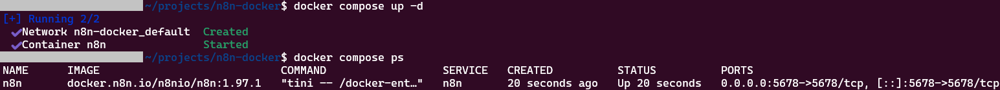
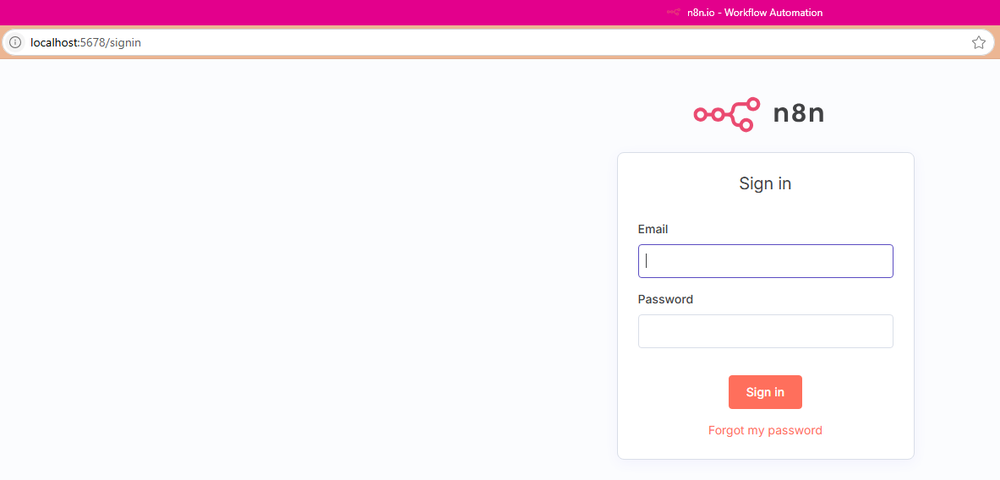

# n8n local Docker Compose Deployment

This project offers a straightforward and secure method to run [n8n](https://n8n.io/) with Docker Compose on Ubuntu.  
n8n is an open-source workflow automation tool that allows you to connect various applications and services to automate tasks without writing code.  
This guide will help you deploy n8n locally using Docker Compose, ensuring your data is persistent and easily manageable.

## Table of Contents

- [n8n local Docker Compose Deployment](#n8n-local-docker-compose-deployment)
  - [Table of Contents](#table-of-contents)
  - [Prerequisites](#prerequisites)
  - [Deployment Steps](#deployment-steps)
  - [Access n8n Dashboard](#access-n8n-dashboard)
  - [Useful Commands](#useful-commands)
    - [View Logs](#view-logs)
    - [Stop n8n](#stop-n8n)
    - [Start n8n](#start-n8n)
    - [Update to a Newer Version of n8n](#update-to-a-newer-version-of-n8n)
    - [Backup n8n Data](#backup-n8n-data)
    - [Restore n8n Data](#restore-n8n-data)
    - [Clean Up (Remove Container but Keep Data)](#clean-up-remove-container-but-keep-data)
  - [Note](#note)
  - [References](#references)

## Prerequisites

- [Docker](https://docs.docker.com/engine/install/ubuntu/) installed
- [Docker Compose](https://docs.docker.com/compose/install/) installed
- An existing Docker volume for persistent data (see below)

## Deployment Steps

1. **Clone this repository**
  
   ```sh
   git clone <your-repo-url>
   cd n8n-docker
   ```

2. **Create the Docker volume (if not already created)**  

   ```sh
   docker volume create n8n_data
   ```

3. **Set the n8n version**  
   Edit the `.env` file to specify the desired n8n version:

   ```env
   N8N_VERSION=1.97.1
   ```

4. **Start n8n using Docker Compose**  

   ```sh
   docker compose up -d
   ```



## Access n8n Dashboard

- Open your browser and go to: [http://localhost:5678](http://localhost:5678)



## Useful Commands

### View Logs

```sh
docker compose logs -f
```

### Stop n8n

```sh
docker compose stop
```

### Start n8n

```sh
docker compose start
```

### Update to a Newer Version of n8n

1. Edit `.env` and change `N8N_VERSION` to the desired version.
2. Pull the new image and recreate the container:

   ```sh
   docker compose pull
   docker compose up -d
   ```

### Backup n8n Data

```sh
```sh
docker run --rm -v n8n_data:/data -v $(pwd):/backup ubuntu bash -c 'tar czvf /backup/n8n_data_backup_$(date +%Y%m%d_%H%M%S).tar.gz -C /data .'
```

### Restore n8n Data

```sh
# List available backup files
ls -lh n8n_data_backup_*.tar.gz

# Restore a specific backup (replace the filename with the desired timestamped backup)
docker run --rm -v n8n_data:/data -v $(pwd):/backup ubuntu bash -c "cd /data && tar xzvf /backup/n8n_data_backup_YYYYMMDD_HHMMSS.tar.gz --strip 1"
```

### Clean Up (Remove Container but Keep Data)

```sh
docker compose down
```

>*This removes the container but keeps the `n8n_data` volume.*

---

## Note

- Your workflows and credentials are stored in the `n8n_data` Docker volume.
- To remove all data, delete the volume:  

  ```sh
  docker volume rm n8n_data
  ```

## References

- [n8n Documentation](https://docs.n8n.io/)
- [n8n GitHub Repository](https://github.com/n8n-io/n8n)
- [n8n Getting Started (YouTube)](https://www.youtube.com/watch?v=3w7xIMKLVAg)
- [n8n Workflows Playlist (YouTube)](https://www.youtube.com/playlist?list=PLvL2NEhF_6C6KQwQwQvQnQwQwQwQwQwQw)
- [n8n Community Forum](https://community.n8n.io/)
- [Docker Documentation](https://docs.docker.com/)
- [Docker Volumes Documentation](https://docs.docker.com/storage/volumes/)
- [Docker Networking Documentation](https://docs.docker.com/network/)
- [Docker Security Best Practices](https://docs.docker.com/engine/security/security/)
- [Docker Compose Documentation](https://docs.docker.com/compose/)
- [Docker Compose Best Practices](https://docs.docker.com/compose/best-practices/)
- [Docker Compose Environment Variables](https://docs.docker.com/compose/environment-variables/)
